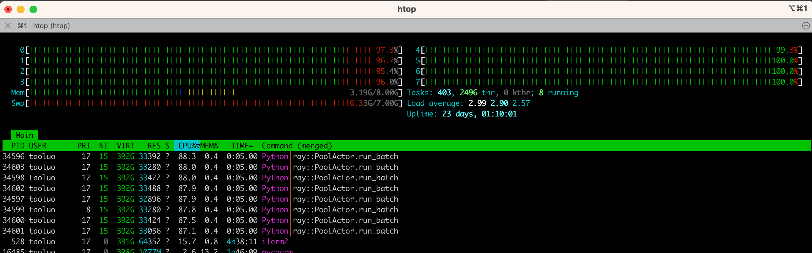

# Data Engineering Coding Challenges

## Problem 1: Fixed-Width File Parse

- Generate a fixed width file using the provided spec (offset provided in the spec file represent the length of each field).
- Implement a parser that can parse the fixed width file and generate a delimited file, like CSV for example.
- DO NOT use python libraries like pandas for parsing. You can use the standard library to write out a csv file (If you feel like)
- Language choices (Python or Scala)
- Deliver source via github or bitbucket
- Bonus points if you deliver a docker container (Dockerfile) that can be used to run the code (too lazy to install stuff that you might use)
- Pay attention to encoding

### How to run 
```
# pull the docker image
docker pull ghcr.io/lorne-luo/code_kata/problem1:latest

# run docker container, the generated files will copied into you current local path
docker run -v .:/app/problem1/data ghcr.io/lorne-luo/code_kata/problem1

# check result on Mac/Linux
cat generated.txt
cat parsed.csv

# on Windows
Get-Content generated.txt -Head
Get-Content parsed.csv -Head

```

## Problem 2

- Generate a csv file containing first_name, last_name, address, date_of_birth
- Process the csv file to anonymise the data
- Columns to anonymise are first_name, last_name and address
- You might be thinking  that is silly
- Now make this work on 2GB csv file (should be doable on a laptop)
- Demonstrate that the same can work on bigger dataset
- Hint - You would need some distributed computing platform

### How to run 
```
# pull the docker image
docker pull ghcr.io/lorne-luo/code_kata/problem2:latest

# run docker container
# with volume mount the generated files will appear in current local path
docker run -v .:/app/problem2/data ghcr.io/lorne-luo/code_kata/problem2

# check result files on Mac/Linux
head generated.csv
head anonymised.csv

# on windows
Get-Content generated.csv -Head
Get-Content anonymised.csv -Head
```

### Performance
Implemented in very efficient way
- Random text is generated at the optimal speed for Python
- Ultilised [ray](https://docs.ray.io/) as a parallel computing platform, making it easy to scale multiprocessing from a single node [to distributed cluster](https://docs.ray.io/en/latest/ray-more-libs/multiprocessing.html). 
- As shown in the screenshot, my implementation maximizes the power of the 8-core CPU

- Due to time constraints, only the CSV generation was adapted for multiprocessing; the anonymizer was not.
- On my M1 MacBook Air (with nearly full SSD, which may have caused lower disk I/O speed):
  - 2GB CSV generation is completed in 179 seconds
  - The single-process anonymizer completes its task in 333 seconds
  
## About Code
To make code smell good and easy to review:
- Only used Python built-in functions, except the distributed computing framework [Ray](https://docs.ray.io/)
- Followed type hint and used [mypy](https://github.com/python/mypy) for type validation
- Used [black](https://github.com/psf/black) to enforce code formatting
- Used [flake8](https://github.com/PyCQA/flake8) to check code style
- Used [isort](https://github.com/PyCQA/isort) to sort import statements
- Created Github Action pipeline to publish Docker images
